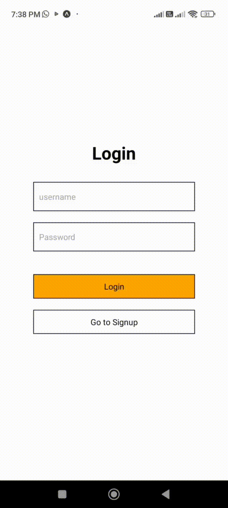
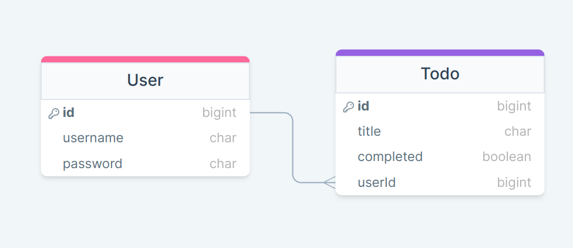

# Todo app 
## Tech Stack 
1. ExpressJS 
2. React Native 
3. SQLite / Prisma ORM

# Installation 
## Backend 

1. open backend folder 
```
cd todo-API
```

2. install dependencies 
```
npm install
```

3. migrate database 
```
npx prisma migrate dev --name init
```

4. run server 
```
node app 
```
<br>
<hr>
<br>

## Frontend

1. open frontend folder 
```
cd todo-app
```

2. install dependencies 
```
npm install
```

3. change API_IP in .env file to your local IP address 
```
API_IP=YOUR_LOCAL_IP_ADDRESS
```

4. run app 
```
npm start
```

# Video Demo



# Datatbase Schema


